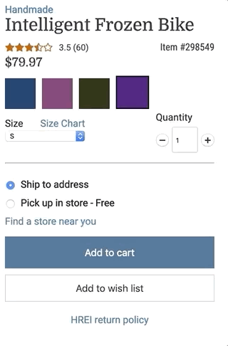

# HREI - Product Options Service

This repo includes the Product Options service of HREI—an outdoor equipment e-commerce application. The service can be viewed here: https://fec4-product-options.herokuapp.com/

Upon refresh, the service renders information for a random product loaded from a MongoDB Atlas database. Products may have several variants of different prices, colors, and sizes. The Product Options service enables users to select and view all variants of a particular product.

## Related Projects/Services

  - https://github.com/hrr36-fec4/fec4-reviews
  - https://github.com/hrr36-fec4/fec4-related-items-and-size-chart

## Installation/Usage

1. Fork/clone the repo
2. Ensure that MongoDB is installed
3. Run `npm install` to install the project's dependencies
4. Run `mongod` to start the MongoDB process
5. Run `npm run db-setup` to seed the MongoDB database
6. Run `npm run webpack-build-dev` to compile the `bundle.js` file and watch for changes
7. Run `npm run start-local` to start the server
8. Navigate to `http://localhost:3001` to view the service
